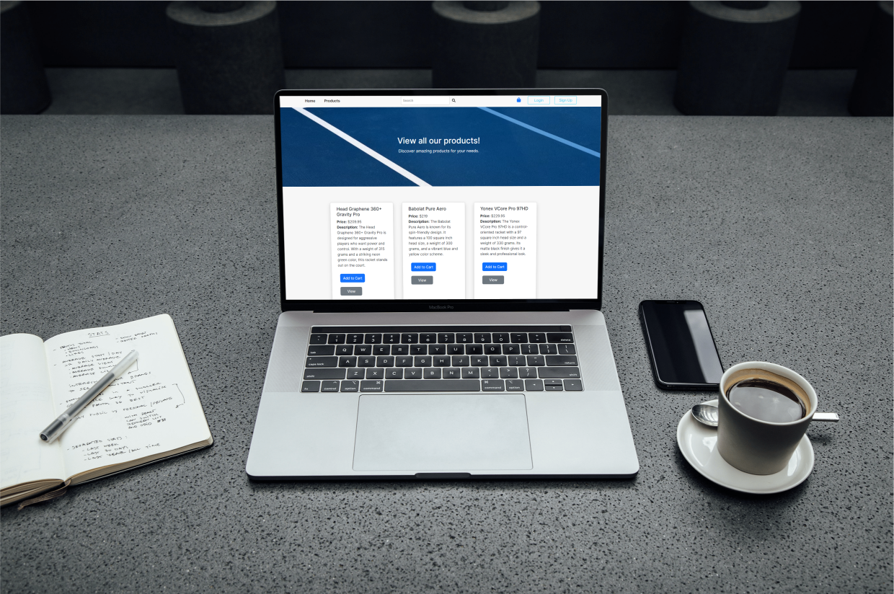
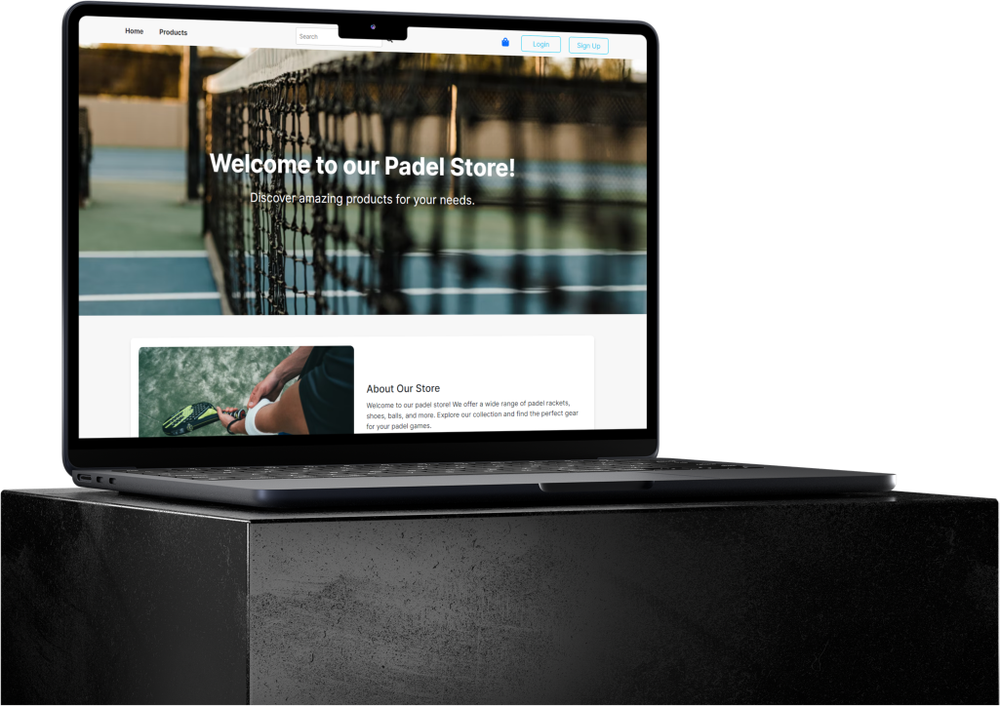
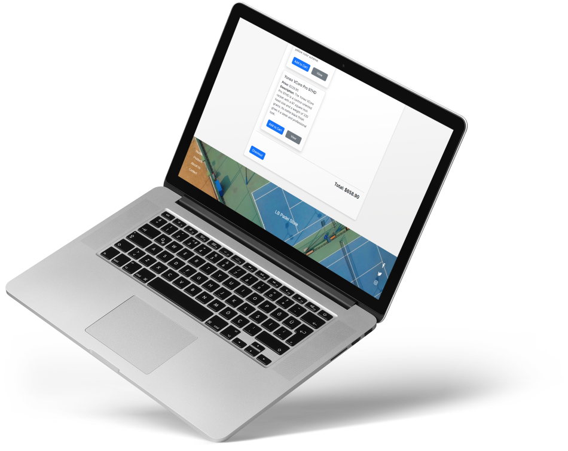

<!-- HEADER SECTION -->
<h5 align="center" style="padding:0;margin:0;">Luca Breebaart</h5>
<h5 align="center" style="padding:0;margin:0;">Student Number 221345</h5>
<h6 align="center">DV200 2023</h6>
</br>
<p align="center">

  <a href="https://github.com/luca-breebaart/LB-Padel">
    
  </a>
  
  <h3 align="center">LB-Padel</h3>

  <p align="center">
   Welcome to the Padel Store E-Commerce Website! This project is a web-based e-commerce platform for selling Padel Rackets. Below, you'll find a comprehensive README with all the information you need to get started, run the project, and customize it according to your needs. 
    <br>
   <br>
      <a href="https://github.com/luca-breebaart/LB-Padel"><strong>Explore the docs »</strong></a>
   <br />
   <br>
   <a href="//">View Demo Video</a>
   <br />
    
    
</p>
<!-- TABLE OF CONTENTS -->
<h3>Table of Contents</h3>

* [About the Project](#about-the-project)
  * [Project Description](#project-description)
  * [Built With](#built-with)
* [Getting Started](#getting-started)
  * [Prerequisites](#prerequisites)
  * [How to install](#how-to-install)
* [Features and Functionality](#features-and-functionality)
* [Concept Process](#concept-process)
   * [Wireframes](#wireframes)
* [Development Process](#development-process)
   * [Implementation Process](#implementation-process)
        * [Highlights](#highlights)
        * [Challenges](#challenges)
   * [Future Implementation](#peer-reviews)
* [Final Outcome](#final-outcome)
    * [Mockups](#mockups)
    * [Video Demonstration](#video-demonstration)
* [Conclusion](#conclusion)

<!--PROJECT DESCRIPTION-->
## About the Project
<!-- header image of project -->


### Project Description

The Padel Store E-Commerce Website is designed to showcase and sell Padel Rackets online. It provides features for browsing and selecting products, adding them to the cart, and completing the purchase. This project serves as a foundation for building a fully functional e-commerce website.

### Built With

- **Frontend:**
  - React.js: A JavaScript library for building user interfaces.
  - React Bootstrap: A library of pre-designed Bootstrap components.
  - React Router: For handling routing and navigation within the application.

- **Backend:**
  - Node.js: A runtime environment for running JavaScript on the server.
  - Express.js: A Node.js web application framework.
  - MongoDB: A NoSQL database for storing product data.
  - Mongoose: An ODM library for MongoDB.

## Getting Started

The following instructions will get you a copy of the project up and running on your local machine for development and testing.

### Prerequisites

Before getting started, ensure you have the following software installed:

- [React](https://react.dev/learn/installation)
- [React Router](https://reactrouter.com/en/main)

### How to install

### Installation
Here are a couple of ways to clone this repo:

1. Software </br>
Create a working folder in which you want this file saved. Then open the folder

`Visual Studio Code` -> `File` -> `Open` -> `Folder Name`</br>

2. Clone Repository </br>
Run the following in the command-line in the terminal to clone the project:
   ```sh
   git clone https://github.com/luca-breebaart/DriveSphere.git
   ```
    Then `cd client` as well as `cd server`

3. Install Dependencies </br>
Run the following in the command-line to install all the required dependencies:

   ```sh
   npm install
   ```
4. Start the Server:

   ```sh
   npm start
   ```

<!-- FEATURES AND FUNCTIONALITY-->

## Features and Functionality

- **Product Listing:** Display a list of Padel Rackets with details such as name, brand, price, and description.
- **Product View:** View individual product details, including images, and add products to the cart.
- **Shopping Cart:** Manage items in the cart and proceed to checkout.
- **Checkout:** Review cart items and complete the purchase with total calculation.
- **Admin Panel:** Admins can add, update, and delete products from the store.
- **Responsive Design:** The website is designed to work seamlessly on various screen sizes.

## Concept Process

### Wireframes


<br>

<br>


## Development Process

### Implementation Process

#### Highlights

#### Challenges

### Future Implementation

<!-- MOCKUPS -->
## Final Outcome

### Mockups


<!-- VIDEO DEMONSTRATION -->
### Video Demonstration

To see a run-through of the application, click below:

[View Demonstration](BreebaartLuca_221345_DV200_Presentation_Video.mp4](https://drive.google.com/file/d/1nRaDlIqRUVv-yLDZjAS0ofccUM6J9VNP/view?usp=sharing)

<!-- AUTHORS -->
## Authors

* **Luca Breebaart** - [luca-breebaart](https://github.com/luca-breebaart)
